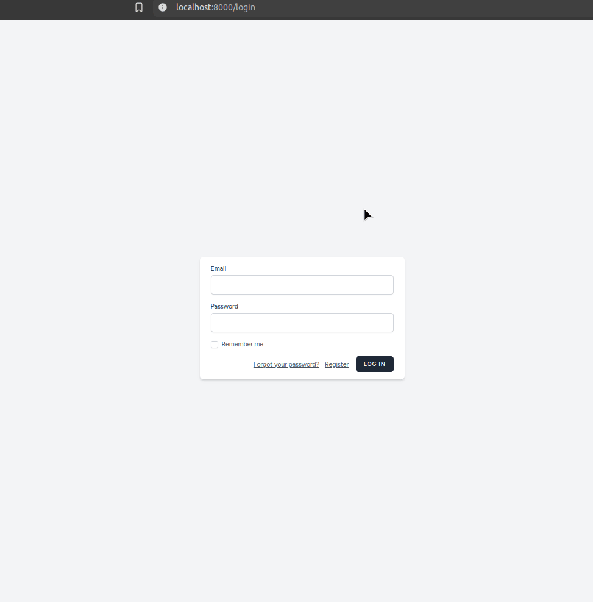

<h1 align="center">LLKC assigment</h1>

<h2 align="center">Description</h2>

<p align="center">
This is a web App that uses Laravel 11, Tailwind CSS, React and TypeScript. It allows basic authentication, user creation, update and deletion as well as recover their passwords. Only registered and authenticated users are able to manage their assets. App features CRUD functionality for Farms and Farm animals. 
Each user can create, update or delete Farms and add, update or remove Animals at each Farm.
Each user can access only their farms and animals data. Each Farm can hold up to 3 animals.
</p>



<h2 align="center">Requirements</h2>
<p>PHP > 8.2</p>
<p>Composer > v2.7.7</p>
<p>Node.js > v22.4.1</p>
<p>Docker (Optional, for Sail)</p>

<h2 align="center">Setup</h2>

- ```git clone https://github.com/ambivalent-axiom/llkc-assignment.git``` Clone the Repository
- Set Up Environment File: update .env.example and store as .env | set postgresql for docker or sqlite for local development environment
- ```composer install``` Install PHP Dependencies
- ```php artisan key:generate``` Generate Application Key
- ```php artisan migrate``` Launch migration to create schemas
- ```npm install``` Install Frontend Dependencies
- ```npm run build``` Build Frontend
- ```php artisan serv``` Serve the Application
- Open ```localhost:8000``` in web browser.

<h2 align="center">Run with Docker</h2>
Docker Setup (Using Laravel Sail)

- ```./vendor/bin/sail up``` Start up the container
- ```./vendor/bin/sail artisan migrate``` Launch migration to create schemas
- Open ```localhost``` in web browser.

<h2 align="center">Commands</h2>

- ```php artisan db:seed``` Populate database with some example data<br>

<h2 align="center">Tests</h2>

Automated testing is done by using Pest. Run all feature tests with command:
- ```./vendor/bin/pest```


<h2 align="center">Contact</h2>
If you have any questions or feedback, feel free to reach out:<br>
Email: artmelnis@gmail.com
