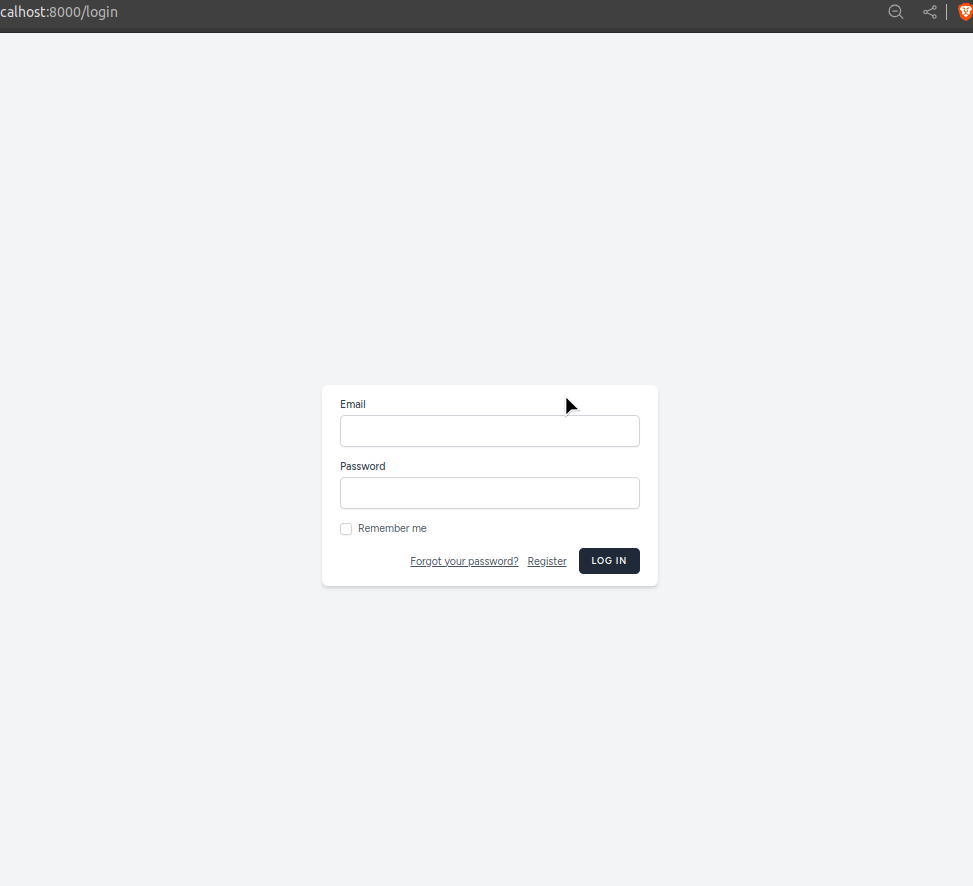

<h1 align="center">LLKC assigment</h1>


<p align="center">

Using Laravel 11 and React create:
Basic Auth: only logged in users are able to manage entities
CRUD functionality for: Farms and Farm Animals.
Each user can create Farms and add Animals to each Farm.
Each user can access only their farms and animals data
Farms table structure: Name (required), email, website (optional)
Animals table structure: Animal Number (required), Type name (required), years (optional)
Use migrations to create schemas
Use database seeds to create two users who each has two farms with some animals in each farm
Validate form data in both frontend and backend. Allow only 3 animals for each farm.
Use pagination for showing Farms/Animals list, 10 entries per page
Use resource controllers with default methods - index, create, store etc.
Use tailwind
Use Typescript
Use Docker to run project locally
Use automated testing (edited)
</p>




<h2 align="center">Requirements</h2>
<p>PHP > 8.2</p>
<p>Laravel > 11.9</p>
<p>node > v22.4.1</p>

<h2 align="center">Setup</h2>

- ```git clone https://github.com/ambivalent-axiom/llkc-assignment.git```
- update .env.example and store as .env
- ```composer install```
- ```php artisan migrate```
- ```php artisan serv```
- ```php artisan key:generate```
- ```npm install```
- ```npm run build```
- Open ```localhost:8000``` in web browser.

<h2 align="center">Run with Docker</h2>
- ```./vendor/bin/sail up```
- Open ```localhost``` in web browser.

<h2 align="center">Commands</h2>

- ```php artisan db:seed``` Populate database with some example data<br>

-- END of readme.md --
